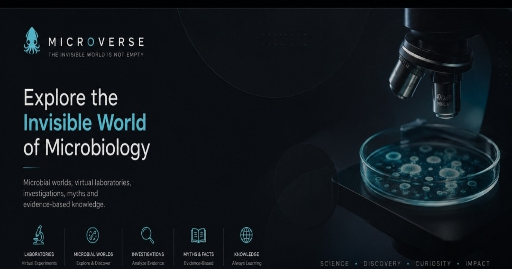

# MICROVERSE 🦑

*"THE INVISIBLE WORLD IS NOT EMPTY."*

 

A free, non-profit interactive microbiology exploration platform - 12 microbial worlds, 250 real organisms, and dozens of hands-on lab and reasoning modules, built as a genuine teaching tool rather than a trivia site. No lorem-ipsum content, no invented citations, no fabricated scientific claims. Created independently by Zekraoui Rabah AllaaEddine as an educational project.

## Sections

- **Worlds** - 12 thematic microbiology domains (Hospital, Food, Soil, Freshwater, Marine, Pharmaceutical, Fermentation, Human Microbiome, Industrial, Extreme Environment, Oral, Forensic), each linking down into specific Spaces and Scenarios
- **Microorganism Explorer** - 250 real organisms across five kingdoms (50 bacteria, 50 fungi, 50 protozoa, 50 viruses, 50 algae), each with morphology, habitat, ecological role, and one genuinely specific fact rather than filler
- **Virtual Laboratory** - simulated Gram stain microscopy, culture, biochemical testing, a molecular biology walkthrough, and an environmental sampling comparison
- **Microbial Crime Scene** - fictional educational investigations that reconstruct a contamination pathway from a timeline and an evidence board
- **The Unknown** - a progressive-evidence organism identification exercise
- **Think Like a Microbiologist** - interactive decision trees for reasoning through common microbiology decision points
- **Myth Machine** - 40 common microbiology claims tested against evidence, with the underlying scientific principle explained
- **Experiments hub** - a qualitative "What Happens If" simulation engine, an experiment designer that checks for missing controls, a lab error detector, and a One Microbe Five Worlds comparison tool
- **Glossary & References** - a searchable 105-term glossary and a references page pointing to WHO, CDC, FDA, ISO, EPA, USP, ASM and NOAA rather than invented citations
- **Check Our Other Websites** - links to the creator's other independent projects, added as they go live

## Features

- Fully trilingual: English, French, Arabic (with RTL support) - all 12 worlds, the glossary, the myths, space names, and all 250 organism names translated, not just interface labels
- No login, no backend, no tracking beyond the visitor's own device - pure static site, deployable directly to GitHub Pages
- Scientific-integrity status badges (established principle / simplified model / conceptual simulation / fictional scenario) on every module, so nothing pretends to be a real diagnosis
- Local-only progress and achievements saved on-device, with a one-click reset, no account required

## Tech

Plain HTML/CSS/JavaScript. No build step, no framework dependencies. 

## License / Contact

Free to use, always. This project is independent and non-commercial. Questions or feedback: reach out on [LinkedIn](https://www.linkedin.com/in/zekraouirabahallaaeddine), or see the Support section in the app for voluntary contributions.

---

## What's in this build

This is a fully functional MVP of the full MICROVERSE architecture described in the master build prompt. Every module works end to end. Content volume is a genuine, non-fabricated starting slice rather than the full target scale, so the platform can grow honestly over time instead of padding numbers with filler.

Current dataset size (also shown live on the homepage, calculated from the data files themselves):

| Dataset | Count in this build | Long-term target |
|---|---|---|
| Worlds | 12 | 100+ |
| Spaces | 36 | 500+ |
| Scenarios | 24 | 1000+ |
| Glossary terms | 105 | 1000+ |
| Organisms (bacteria/fungi/protozoa/virus/algae) | 250 (50 per kingdom) | 500+ per kingdom |
| Investigations | 4 | 200+ |
| Myths tested | 40 | 200+ |
